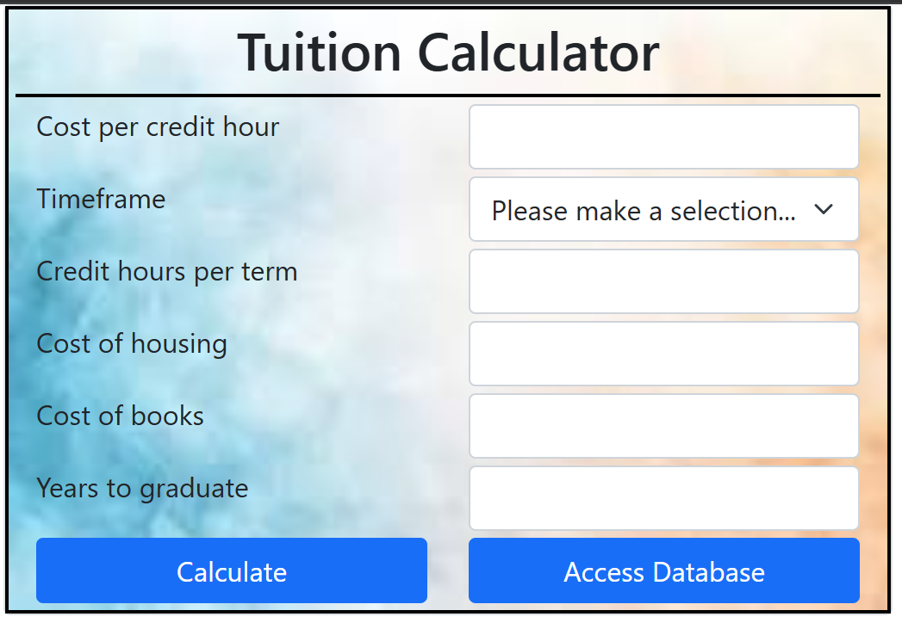

# 🎓 Tuition Calculator Web App

  
  
  
  

---

## 📑 Table of Contents
- 📌 [Summary](#-summary)
- ⭐ [How It Works](#-how-it-works)
- ✨ [Features](#-features)
- 🧰 [Tech Stack](#-tech-stack)
- 🔧 [Development Tools](#-development-tools)
- 🧩 [Core Concepts](#-core-concepts)
- 📝 [New Topics Covered](#-new-topics-covered)
- 📘 [What I Learned](#-what-i-learned)
- 🖼 [Screenshots](#-screenshots)

---

## 📌 Summary

The **Tuition Calculator Web App** is an interactive browser-based application designed to help users estimate the cost of tuition based on selected inputs such as credit hours, residency status, and other applicable fees.

Featuring ASP.NET MVC framework and a full Sql Server relational database on the backend to store you budgets, you can seamlessly work with your information.

I wrote this application as my winning 1st place submission for the Skills USA 2025 - Nebraska State Championships competition.

This project focuses on combining **user input validation**, **real-time calculations**, and **clean UI design** to deliver a practical and user-friendly financial estimation tool.

---

## ⭐ How It Works

1. Enter the required academic and financial inputs:
   - Number of credit hours
   - Residency status (in-state/out-of-state)
   - Additional applicable fees
2. Click the **Calculate** button
3. The app:
   - Validates all inputs
   - Computes tuition costs
   - Displays a detailed breakdown of charges
4. Adjust inputs as needed to instantly see updated totals

---

## ✨ Features

- 🧮 Dynamic tuition calculation based on user input  
- ✅ Input validation with clear error messaging  
- 📊 Real-time cost breakdown (tuition, fees, total)  
- ⚡ Instant updates without page reloads  
- 🎯 Simple, intuitive user interface  
- 📱 Responsive design for multiple screen sizes  

---

## 🧰 Tech Stack

### Frontend
- 🧱 **HTML5** – Structure and layout  
- 🎨 **CSS3** – Styling and responsiveness  
- ⚡ **JavaScript (ES6)** – Logic, validation, and calculations
- ASP.NET MVC Framework

### Backend
- SQL Server Database
- Entity Framework Data Access API

---

## 🔧 Development Tools

- 💻 Visual Studio Code  
- 🌐 Web Browser DevTools  
- 🗂 Git & GitHub for version control  

---

## 🧩 Core Concepts

- DOM manipulation  
- Event-driven programming  
- Form validation techniques  
- Conditional logic for calculations  
- Data formatting and output display  
- Separation of concerns (structure, style, logic)  

---

## 📝 New Topics Covered

- 🔄 Real-time UI updates without reloads  
- 📏 Financial calculation logic and rounding  
- 🧼 Input sanitization and validation patterns  
- 🎯 Improving UX through feedback messaging  
- 📐 Structuring scalable front-end logic  

---

## 📘 What I Learned

This project strengthened my ability to build **interactive web applications** that solve real-world problems.

Key takeaways include:
- Designing intuitive user workflows  
- Writing clean, maintainable JavaScript logic  
- Handling edge cases in user input  
- Structuring front-end applications for scalability  
- Enhancing user experience through validation and feedback  

---

## 🖼 Screenshots

### Main Page

